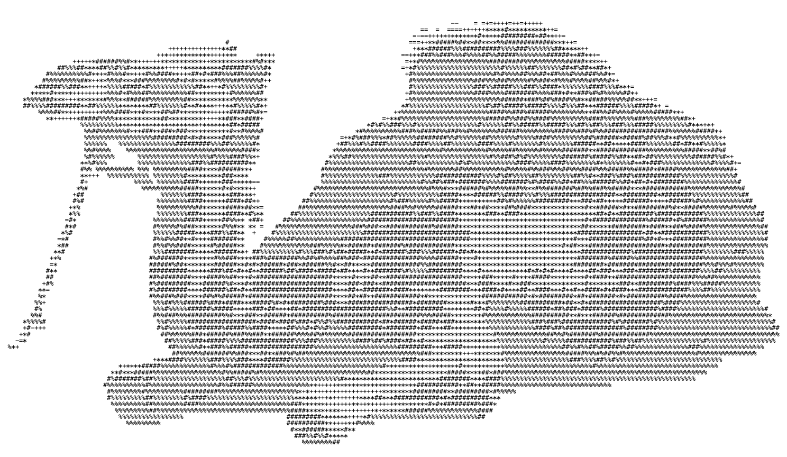

# Camol

Camol is a terminal-native, local-first control plane for human-guided agent work.
You develop and challenge a plan with an orchestration agent, approve its exact
digest, and let the deterministic harness distribute bounded tasks across as many
isolated boxes as the plan and connected capacity justify.

Camol is the harness—not an agent, model, terminal multiplexer, VM, or provider
account. Orchestration agents, worker agents, models, transports, execution targets,
and evaluators are replaceable components. The kernel owns durable truth about
plans, state, readiness, authority, leases, evidence, budgets, retries, integration,
and completion.

> Project status: **Product V0 is runnable developer software.** The terminal client,
> persistent planning/approval records, detachable supervisor, local-process proof,
> and kernel are `BACKED` by automated local tests. Claude/Fable execution remains
> `SPECULATIVE` until an owner-authorized live run proves the requested model resolves
> to the frozen allowlist on that account. Codex and local models are planning-only in
> V0; OpenAI Platform is connection-discovery only. Remote deployment, VM provisioning,
> and production security are not claimed.

<table>
  <tr>
    <td width="48%">
      <pre>
      ___           ___           ___           ___
     /\__\         /\  \         /\  \         /\  \
    /:/  /        /::\  \       |::\  \       /::\  \
   /:/  /        /:/\:\  \      |:|:\  \     /:/\:\  \
  /:/  /  ___   /:/ /::\  \   __|:|\:\  \   /:/  \:\  \   ___
 /:/__/  /\__\ /:/_/:/\:\__\ /::::|_\:\__\ /:/__/ \:\__\ /\  \
 \:\  \ /:/  / \:\/:/  \/__/ \:\~~\  \/__/ \:\  \ /:/  / \:\  \
  \:\  /:/  /   \::/__/       \:\  \        \:\  /:/  /   \:\  \
   \:\/:/  /     \:\  \        \:\  \        \:\/:/  /     \:\/:/
    \::/  /       \:\__\        \:\__\        \::/  /       \::/
     \/__/         \/__/         \/__/         \/__/         \/__/
      </pre>
    </td>
    <td width="52%" align="right">
      
    </td>
  </tr>
</table>

The wordmark and supplied PNG are the canonical boot assets. The CLI now renders the
wordmark from the upper-left and a plaintext camel derived from that artwork,
right-adjusted at wide and medium terminal sizes with compact fallbacks.

## Install and open Product V0

Camol requires Python 3.9+ and a Git repository. Textual is an optional dependency;
without it, bare `camol` opens the same command engine in line mode.

```bash
git clone --branch codex/product-v0 --single-branch \
  https://github.com/Birukedotcom/Camol-Harness.git Camol-Harness-v0
cd Camol-Harness-v0
python3 -m venv .venv
.venv/bin/python -m pip install --upgrade pip
.venv/bin/python -m pip install -e '.[tui]'
source .venv/bin/activate
camol
```

For an isolated command available outside the clone, use pipx after the branch is
published:

```bash
pipx install 'camol-harness[tui] @ git+https://github.com/Birukedotcom/Camol-Harness.git@codex/product-v0'
cd /path/to/a/clean/git/repository
camol
```

Homebrew is a follow-on distribution target; this repository does not pretend a
formula exists yet.

Inside Camol, a first live-capable plan looks like this:

```text
/connections
/login claude                 # only if the provider reports auth_required
/model claude:fable
/effort max
/grill Build the feature and prove it without deployment
                               # answer each visible question; task lines define N
/plan                          # inspect invariants, DAG, evaluator argv, and digests
/approve yes                   # approval freezes only the exact visible digest
/run --accept-spend --max-cents 10
/status
/boxes
/box 1
/events
/quit                          # detach; does not stop the supervisor
```

`/run` refuses a dirty source checkout and runs one spend-capped, no-tools provider
preflight before it starts a Claude supervisor. The supervisor then prepares isolated
worktrees and will not issue a lease until its task-specific readiness predicate is
green. Use `/drain`, `/resume`, or `/stop` for lifecycle control. Interactive state is
kept outside the repository under the platform state directory; `/status` prints its
exact path.

## The intended terminal experience

Camol opens on the orchestrator. `/grill` turns a goal into an explicit plan by
questioning assumptions, exclusions, invariants, risk, resources, evaluators, and
completion criteria. No task begins until a human confirms the frozen plan and Camol
proves that its exact execution path is ready.

```text
┌ CAMOL / ORCHESTRATOR ───────── DOCKER ■  GIT ■  GCP □  MODELS ■↓ ┐
│ plan: frozen @ 91d3…       state: WAITING_READINESS       ! 2    │
│ goal: ship payment transport without exposing card data          │
├ PLAN / GATES ───────────────────┬ BOXES / LIVE WORK ──────────────┤
│ ✓ human goal                    │ ■ api-builder    EXECUTING      │
│ ✓ invariants                    │ ■ adversary      EVALUATING     │
│ ✓ evaluator bundle             │ □ deploy         AUTH_REQUIRED  │
│ ! GCP deploy authority          │ … 5 dormant; 1 needs attention  │
├ SELECTED EVIDENCE ──────────────┴─────────────────────────────────┤
│ task api-transport · verifier red · response body leaked PAN      │
│ next: return candidate to refinement; deployment remains blocked  │
├───────────────────────────────────────────────────────────────────┤
│ camol> /box api-builder                                          │
└───────────────────────────────────────────────────────────────────┘
── WORKSPACES ──────────────────────────────────────────────────────
[0 ORCH] [BOXES 2/8] [!2] ▸[1 ■ API] [2 ■ ADVERSARY] [3 □ DEPLOY]
```

Glyphs are deliberately contextual. In the top rail, `■` means an account/runtime is
connected or a dependency is installed—it is **not** task readiness. In the bottom
fleet, `■` means an isolated box workspace exists, `□` means dormant/unprepared, and
`!` needs attention. The kernel reports task readiness separately. Selection is a
separate cursor. The bottom switcher traverses
the orchestrator and a window over an arbitrary N-box fleet; box numbers are visible
shortcuts, not permanent roles or a fixed worker count.

Selecting a box opens a read-only peer view of its terminal stream, bounded context,
tool calls, diff, evaluations, events, and evidence. Sending input or taking over is
a distinct, approval-aware, logged transition.

## The operating model

```text
human + orchestration agent
  -> /grill goal, constraints, invariants, evaluators, and resources
  -> human approves exact plan digest
  -> kernel discovers eligible connected capacity
  -> readiness probes prove each task/box combination
  -> scheduler reserves capacity and leases isolated work
  -> boxes emit checkpoints, commands, tools, diffs, usage, and claims
  -> frozen independent evaluators return green or counterexamples
  -> orchestrator integrates accepted candidates or proposes an amendment
  -> human confirms consequential transitions and final acceptance
```

A box may implement a unique task, independently verify another box, explore a
competing implementation, observe a long-running system, or remain dormant. Camol
activates zero to N boxes from useful task-graph width and a human-approved resource
envelope; it never launches boxes merely to fill a target count.

All authoritative box-to-box information passes through the orchestrator and durable
ledger. The orchestrator receives compact checkpoints and typed deltas rather than N
ever-growing raw transcripts.

## Readiness before work

Registered, installed, connected, authenticated, idle, and task-ready are distinct
states. Camol's launch invariant is:

```text
READY_TO_LEASE =
  PLAN_FROZEN
  AND CONTROL_PLANE_READY
  AND TASK_DEPENDENCIES_GREEN
  AND BOX_READINESS_FRESH
  AND EVALUATOR_READY
  AND AUTHORITY_GRANTED
  AND CAPACITY_RESERVED
```

A readiness receipt binds the run, plan, task, box, worker, execution target,
transport, runtime, workspace revision, evaluator, model/provider capability,
credential scope, resource reservation, probe results, and expiration. The runner
rechecks the receipt immediately before launch. Red or stale proof produces a typed
wait such as `AUTH_REQUIRED`, `WORKSPACE_CONFLICT`, `EVALUATOR_NOT_READY`,
`TARGET_UNREACHABLE`, or `READINESS_STALE`; it does not start the agent or collapse
everything into a scheduler deadlock.

## Isolation is layered

Every write-capable task gets a dedicated branch and Git worktree outside the user's
checkout. Run databases, packets, evidence, artifacts, and worktrees live in an
explicit external state directory. A separate orchestrator-owned integration
worktree applies candidates and reruns the frozen evaluator; workers never merge
directly into `main`.

Repository isolation is not process security. Real workers must also launch through
a sandbox with explicit filesystem, process, environment, network, and credential
grants. An unsandboxed local process is labeled `developer_trusted` and cannot earn a
public or production-safe maturity claim. The canonical evaluator definition and
asset blobs remain outside builder write authority; changed workspace copies are
rejected before evaluator execution and before readmission.

## Models and execution targets

Hosted and downloaded models use the same capability-oriented selection path.
Possible execution targets include the local host, containers, VMs, pods, remote
development environments, or provider jobs. A terminal is only a detachable client;
closing it must not stop the supervised Camol daemon.

The first real hosted-model proof is a generic Claude CLI box requesting Claude
Fable 5.1:

```text
Camol daemon
  -> readiness gate + fenced lease
  -> sandboxed box + isolated worktree + Claude CLI adapter
  -> remote Fable 5.1 inference
  <- requested/resolved model, tools, usage, diff, checkpoint, evidence
```

Fable is the first profile, not a kernel dependency. Camol records both the requested
and resolved model, so a provider fallback cannot silently inherit Fable-specific
capability claims. Development may use the owner's supported CLI login; public Camol
uses bring-your-own provider connections or local models and never embeds the
developer's credentials.

## Evaluation, debugging, and hill climbing

States are gated by human-confirmed invariants and visible evidence—not trust in an
existing implementation. `/grill` proposes candidate invariants from the goal,
policy, traces, past behavior, counterexamples, and alternate implementations; a
human confirms the normative set before it becomes a gate.

Every evaluator, generator, threshold, command, result, exception, and approval is
visible. Builder-authored tests can strengthen evidence but cannot replace frozen
tests. Failed evidence returns the task to a bounded refinement loop.

The debugger makes the comparison explicit:

```text
current observed behavior
  -> target behavior
  -> smallest reproducible divergence
  -> bounded experiment
  -> commands, tools, transcripts, environment, diff, and result evidence
  -> independent verification
  -> permanent regression eval
```

Hill climbs compare named measurement vectors. A gain in one dimension cannot hide a
forbidden correctness, security, cost, or latency regression.

## What exists today

The executable Python slice currently provides:

- bare `camol` as a transcript-first Textual application, plus a dependency-light
  line fallback, responsive CAMOL/camel boot art, multiline input, history, streamed
  provider text, and an arbitrary-N fleet switcher;
- durable private orchestrator sessions, a deterministic `/grill` question loop,
  human-readable N-task DAGs, exact plan/runbook digests, two-step approval, and
  automatic invalidation when frozen model or effort settings change;
- credential-safe connection discovery for Claude CLI, Codex CLI, an
  `OPENAI_API_KEY` environment reference, and a loopback OpenAI-compatible endpoint;
- planning-only Claude/Codex/local conversations with no write tools, explicit
  requested-versus-resolved model reporting, and no hidden model call in manual mode;
- a versioned authenticated V2 client protocol for plan, cursor-based events, and
  read-only box views while retaining V1 `camol ctl` compatibility;
- terminal supervisors that remain inspectable after completion, plus automatic
  short private AF_UNIX paths on systems with small socket limits; and

- validated JSON runbooks with an arbitrary non-empty registered worker pool;
- a positive per-run `max_concurrency` ceiling;
- task dependencies and static capability matching;
- frozen plan digests and human approval;
- an append-only SQLite event ledger and deterministic replay;
- packet-hash-bound results and restart recovery after an unconsumed result;
- compact checkpoints instead of automatic transcript growth;
- evidence requirements, verifier commands, retries, and token budgets;
- debugger-case promotion into evals;
- vector-based hill-climb comparison;
- one canonical JSON digest function (`camol.schema.canonical_digest`) shared by
  plans and every readiness contract;
- versioned, validated `ProbeResult`, `ReadinessReceipt`, `WorkspaceReceipt`,
  `CapacityReservation`, `CapabilityGrant`, and `LeaseFence` contracts
  (`camol.readiness`), plus the twelve typed non-runnable reasons;
- runbook schemas v1-v4 with explicit migrations, strict current fields, and pinned
  v1 digests;
- `READINESS_RECORDED`, `TASK_WAITING`, and `TASK_WAIT_CLEARED` ledger events;
- a `BoxBinding`, `AuthorityPolicy`, and `ProbePolicy` identity model that binds every
  proof record to one lease subject, plus the pure `READY_TO_LEASE` predicate; and
- `camol doctor`: a read-only probe registry that proves task-specific readiness
  (state directory, artifact sink, Git, repository revision and dirty state, adapter
  and tool binaries, evaluator bundle, disk, capacity) and emits candidate readiness
  receipts without launching, downloading, authenticating, or spending anything;
- task-specific isolated Git worktrees, enforced sandbox policies, reservations,
  fenced leases, pre-launch rechecks, typed waits, and N-box scheduling;
- complete redacted command/tool/transcript/diff evidence and content-addressed
  export verification;
- a modular Claude CLI adapter with explicit spend preflight and requested-versus-
  resolved model identity;
- a detached single-writer supervisor with authenticated local control, drain,
  salvage, orphan-process reconciliation, and no-blind-retry external effects; and
- evaluator bundles compiled outside builder authority, protected evaluator assets,
  separate candidate-verifier worktrees, generation-based integration, visible
  counterexamples/refinement, and matched vector-valued benchmark comparison.

A green `camol doctor` is not a lease: it proves readiness dimensions only, shows
that a grant and a reservation are still missing, and is possible only for a
verified local interpreter adapter. Any hosted or unverified adapter additionally
requires provider and network proof, which no probe adapter can supply yet, so
such runbooks exit 2. Receipts produced with `--now` are synthetic fixtures that
the lease predicate rejects. Consequently, the
included fake-agent and deterministic dogfood runs prove kernel semantics only. A
hosted-model run additionally needs explicit provider readiness and spend approval.
See [docs/readiness.md](docs/readiness.md).

## Build path

The implementation sequence is deliberately narrow:

| Milestone | Deliverable |
|---|---|
| M0 (implemented; `SPECULATIVE` maturity) | Versioned readiness, workspace, reservation, grant, and lease-fence schemas |
| M1 (implemented for the local process adapter only; `SPECULATIVE` maturity) | Read-only probe registry and `camol doctor` |
| M2 (implemented) | External state directory, isolated worktrees, integration workspace, sandbox boundary |
| M3 (implemented) | Task-specific readiness gates, reservations, fenced leases, typed waits |
| M4 (implemented) | Complete redacted event and content-addressed artifact capture |
| M5 (implemented; live proof pending) | Modular Claude CLI adapter and speculative Fable profile |
| M6 (implemented locally) | Detachable client, supervised daemon, recovery, drain, and effect reconciliation |
| M7 (kernel implemented; hosted proof pending) | Frozen evaluator, controlled failure injection, matched-trial contract, and deterministic Camol-on-Camol proof |

The [v0 build plan](docs/v0-build-plan.md) gives each milestone its expected files,
tests, failure cases, and exit gate. Dynamic VM provisioning, multi-provider routing,
automatic local-model downloads, GCP/voice workflows, the repository graph UI,
benchmark-scale N-box campaigns, Homebrew distribution, and the spatial visualizer
come after the one-box vertical slice is backed.

## Run the current deterministic proof

Python 3.9+ is sufficient and the simulator has no runtime dependencies:

```bash
python3 -m unittest discover -v
python3 -m camol validate examples/local-n-box-runbook.json
python3 -m camol doctor examples/local-n-box-runbook.json --workspace . --state-dir /path/outside/repo
python3 -m camol run examples/local-n-box-runbook.json \
  --workspace . \
  --state-dir /path/outside/repo/demo-state \
  --approve-by "$USER"
```

Run the reproducible Camol-on-Camol kernel proof from a clean checkout:

```bash
python3 scripts/run_v0_proof.py --output /path/outside/repo/v0-proof
```

The checked-in compact attestation is
[`evidence/v0-local-kernel-proof.json`](evidence/v0-local-kernel-proof.json). It
binds the exact implementation commit and archive-manifest hash while preserving the
explicit boundary that this is not hosted-model evidence.

Or detach a draft run, inspect it, approve the exact plan, and let the daemon continue
after the client exits:

```bash
python3 -m camol start examples/local-n-box-runbook.json \
  --workspace . --state-dir /path/outside/repo/supervised-state
python3 -m camol ctl status --state-dir /path/outside/repo/supervised-state
python3 -m camol ctl approve --state-dir /path/outside/repo/supervised-state --by "$USER"
```

Inspect the replayed projection and immutable event stream:

```bash
python3 -m camol status --db /path/outside/repo/demo-state/camol.sqlite3 --run-id local-n-box-demo
python3 -m camol events --db /path/outside/repo/demo-state/camol.sqlite3 --run-id local-n-box-demo
```

The local N-box example happens to register three fake workers so concurrency is easy
to observe; three is not a product assumption. The legacy
`examples/three-agent-runbook.json` remains frozen as the schema-v1 digest fixture and
is not the in-repository execution example. Use a schema-v3/v4 hosted profile, successful
provider preflight, an enforcing trust tier, and explicit budget approval before a
real hosted-agent run.

## Documentation map

- [Product specification](SPEC.md): authoritative product decisions, state and
  invariant model, transparency, evaluation, security, and reference profiles.
- [v0 build plan](docs/v0-build-plan.md): PR-sized implementation order and exit
  gates for the first readiness-safe Fable dogfood run.
- [V0 verification](docs/v0-verification.md): reproducible proof, failure-injection
  map, maturity boundaries, and matched-comparison rules.
- [V0 independent review](docs/v0-independent-review.md): read-only adversarial
  scope, verdict, disclosed limits, finding, and remediation.
- [Architecture](docs/architecture.md): executable kernel objects, events, delegation,
  bounded context, and feedback loops.
- [Execution topology](docs/execution-topology.md): terminal/target/worker/workspace/box
  identities, N-box scheduling, remote protocols, fencing, and backpressure.
- [Capacity and providers](docs/capacity-and-provider-model.md): resource inventory,
  model suitability, accounts, local models, and the first Fable profile.
- [Runbook reference](docs/runbook-reference.md): current executable JSON schema,
  packets, results, and commands.
- [Readiness contracts and doctor](docs/readiness.md): the lease-subject identity
  model, temporal validity, `READY_TO_LEASE`, the read-only probe registry, exit
  codes, execution guard, and redaction.
- [Debugger protocol](docs/debugger-protocol.md): observed-versus-target behavior,
  experiments, evidence, and eval promotion.
- [Evaluation program](docs/evaluation-program.md): canaries, coding suites,
  long-horizon campaigns, ablations, and direct Claude CLI comparisons.
- [Repository graph](docs/repository-graph.md): dependency rail, source graph,
  execution overlays, box traversal, and later spatial visualization.

The reconstructed Buckeye/cmux/GCP/voice workflow is a demanding reference profile,
not Camol's definition. Every core, adapter, and workflow claim remains separately
labeled `SPECULATIVE`, `MAPPED`, `BACKED`, or `PROVEN` according to replayable
evidence.
